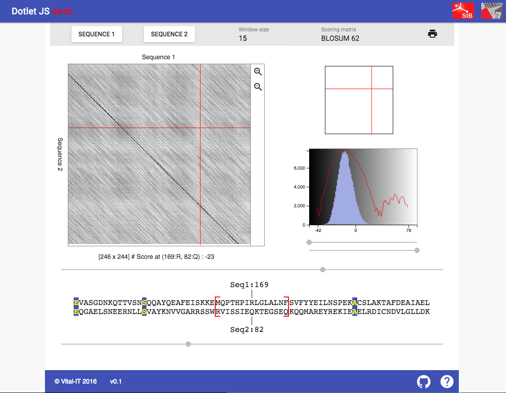

Dotlet reborn
-------------

Dotlet is a web app that produces a dot plot representing the alignment of two protein/nucleotide sequences.

It is a pure client-side Javascript application written with React.

History: The original app was written in Java by Marco Pagni and Thomas Junier (Vital-IT).
Java applets are no more supported by modern web browsers, so it has to be rewritten
with a more modern design, new technologies, and hopefully performance improvements.

Original app: http://myhits.isb-sib.ch/cgi-bin/dotlet

Archive Java source files: ftp://ftp.isrec.isb-sib.ch/pub/software/java/dotlet/

Publication: http://bioinformatics.oxfordjournals.org/cgi/content/abstract/16/2/178

Vital-IT, 2016 - julien.delafontaine@sib.swiss



Technology
----------
Started from [Kriasoft's react-static-boilerplate](https://github.com/kriasoft/react-static-boilerplate):
* React - redux
* Webpack - babel - browsersync - hot loader
* Material Design
* CSS modules


Build from source
-----------------

Install node.js and npm, then from the root directory, run

```
npm install     
node run build [--release] 
```

Start the test server
---------------------

```
node run start [--release]
```

Run tests
---------

```
npm run test[:watch]
```

Deploy in production
--------------------

```
rm -rf public/dist/*
node run build --release
scp -r public/* <DESTINATION>
```

where `<DESTINATION>` is the DocumentRoot in your server configuration.


Structure
---------

`/`

* `run.js`: node tasks and some global config.
* `main.js`: the main call to `ReactDOM.render` and binds the router.
* `webpack.config.js`: build configuration.
* Routing was implemented by default involving many files, 
  but currently only "/" is used (`/pages/home/index.js`).

`/public`

* Everything that is to be copied for distribution. 
  `.ejs` files get compiled to html/xml. In particular, don't try to edit
  the classic `index.html`, but `index.ejs` instead.
* `/dist`: bundled JS with all dependencies and inlined assets.
  If some assets are over some size limit, they appear outside of the bundle.

`/pages`: Routes. Only `home` is actually used in this project.

`/node_modules`: JS dependencies, automatically generated by `npm install`.

`/core`: Things you don't want to touch.

`/components`

* `/actions`: Redux reducers and action creators.
* `/common`: Common helper functions.
* `/constants`: Common variable definitions, to avoid typos.
* `/DensityPanel`: The part showing the scores density as a bar chart.
* `/DotterPanel`: The main dot plot canvas.
* `/GreyScale`: All what concerns the scaling of grey shades.
* `/InfoPanel`: The summary showing the currently inspected position and score.
* `InputPanel`: The top menu with input fields.
* `Layout`: MDL layout structure. Header and footer.
* `TwoSeqsPanel`: The bottom part showing the currently inspected alignment.
* `utils`: Helper components.
